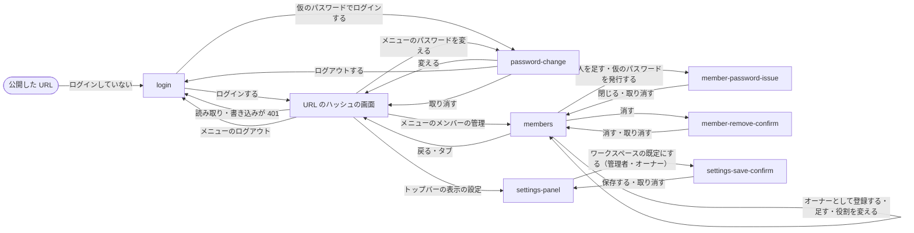

# プレビュー

## 現状

<!-- table: data -->

| 分類 | ページ / ファイル | 概要 | 補足 |
| --- | --- | --- | --- |
| ドキュメント | [設計書/インターフェース定義/プレビュー/プレビューを開く.yaml](https://github.com/shuhei1101/mindstella/blob/develop/dev/%E8%A8%AD%E8%A8%88%E6%9B%B8/%E3%82%A4%E3%83%B3%E3%82%BF%E3%83%BC%E3%83%95%E3%82%A7%E3%83%BC%E3%82%B9%E5%AE%9A%E7%BE%A9/%E3%83%97%E3%83%AC%E3%83%93%E3%83%A5%E3%83%BC/%E3%83%97%E3%83%AC%E3%83%93%E3%83%A5%E3%83%BC%E3%82%92%E9%96%8B%E3%81%8F.yaml) | 開いたらすぐ記録を読んで描く | 更新対象（401 ならログインの画面へ・CSRF のトークンを書き込みに付ける） |
| ドキュメント | [設計書/画面設計/プレビュー/表示の設定.yaml](https://github.com/shuhei1101/mindstella/blob/develop/dev/%E8%A8%AD%E8%A8%88%E6%9B%B8/%E7%94%BB%E9%9D%A2%E8%A8%AD%E8%A8%88/%E3%83%97%E3%83%AC%E3%83%93%E3%83%A5%E3%83%BC/%E8%A1%A8%E7%A4%BA%E3%81%AE%E8%A8%AD%E5%AE%9A.yaml) | 「ワークスペースの既定にする」を誰にでも出す | 更新対象（管理者とオーナーだけに出す） |
| ドキュメント | [設計書/部品設計/プレビュー/表示の設定.ts.yaml](https://github.com/shuhei1101/mindstella/blob/develop/dev/%E8%A8%AD%E8%A8%88%E6%9B%B8/%E9%83%A8%E5%93%81%E8%A8%AD%E8%A8%88/%E3%83%97%E3%83%AC%E3%83%93%E3%83%A5%E3%83%BC/%E8%A1%A8%E7%A4%BA%E3%81%AE%E8%A8%AD%E5%AE%9A.ts.yaml) | 表示の設定の部品 | 更新対象（既定の保存を出すかの引数） |
| ドキュメント | [設計書/部品設計/プレビュー/トップバー.ts.yaml](https://github.com/shuhei1101/mindstella/blob/develop/dev/%E8%A8%AD%E8%A8%88%E6%9B%B8/%E9%83%A8%E5%93%81%E8%A8%AD%E8%A8%88/%E3%83%97%E3%83%AC%E3%83%93%E3%83%A5%E3%83%BC/%E3%83%88%E3%83%83%E3%83%97%E3%83%90%E3%83%BC.ts.yaml) | 題名・検索・ライト / ダーク・タブ | 更新対象（ログインしている人の表示とログアウトの入口） |
| ドキュメント | [設計書/モジュール構成/プレビュー/入口.ts.yaml](https://github.com/shuhei1101/mindstella/blob/develop/dev/%E8%A8%AD%E8%A8%88%E6%9B%B8/%E3%83%A2%E3%82%B8%E3%83%A5%E3%83%BC%E3%83%AB%E6%A7%8B%E6%88%90/%E3%83%97%E3%83%AC%E3%83%93%E3%83%A5%E3%83%BC/%E5%85%A5%E5%8F%A3.ts.yaml) | 起動・画面の振り分け | 更新対象（ログインの画面・パスワードの変更の画面への振り分け） |
| ドキュメント | [設計書/モジュール構成/プレビュー/基盤.ts.yaml](https://github.com/shuhei1101/mindstella/blob/develop/dev/%E8%A8%AD%E8%A8%88%E6%9B%B8/%E3%83%A2%E3%82%B8%E3%83%A5%E3%83%BC%E3%83%AB%E6%A7%8B%E6%88%90/%E3%83%97%E3%83%AC%E3%83%93%E3%83%A5%E3%83%BC/%E5%9F%BA%E7%9B%A4.ts.yaml) | サーバーの配信とのやり取り | 更新対象（401・403 の扱いと CSRF のトークン） |
| 実装 | [plugins/mindstella/skills/mindmap/preview/core/api.ts](https://github.com/shuhei1101/mindstella/blob/develop/plugins/mindstella/skills/mindmap/preview/core/api.ts) | 配信への要求 | 変更対象 |
| 実装 | [plugins/mindstella/skills/mindmap/preview/app.ts](https://github.com/shuhei1101/mindstella/blob/develop/plugins/mindstella/skills/mindmap/preview/app.ts) | 起動と画面の振り分け | 変更対象 |
| 実装 | [plugins/mindstella/skills/mindmap/preview/screens/settings.ts](https://github.com/shuhei1101/mindstella/blob/develop/plugins/mindstella/skills/mindmap/preview/screens/settings.ts) | 表示の設定のパネル | 変更対象 |

<!-- /table -->

## 変更方針

| 対象 | 方針 | 補足 |
| --- | --- | --- |
| ログインの画面 | メンバーを登録したワークスペースでログインしていないときに出す。メンバー ID とパスワードを入れてログインする。失敗とロック中は、どちらが違うかを出さずに失敗を出し、ロック中はその旨を出す | 新しい画面。要素はモック作成と画面設計で決める |
| パスワードの変更 | ログインしている人が自分のパスワードを変える。仮のパスワードでログインしたときは、変えるまでほかの画面へ移れない | 新しい画面かダイアログかは画面一覧・画面遷移で決める |
| メンバーの管理 | 管理者とオーナーに、メンバーの一覧・追加・役割の変更・仮のパスワードの発行を出す。管理者の任命と解任はオーナーにだけ出す。オーナーの行には消す・降格の操作を出さない | 置く場所は `要件.md` の `## 要望` の未確定（推奨 A）。画面一覧・画面遷移で決める |
| 役割による出し分け | メンバーには「ワークスペースの既定にする」とメンバーの管理を出さない。サーバーが 403 を返したら、権限が無い旨を出す | メンバー未登録なら今と同じく全てを出す |
| ログインしている人の表示 | トップバーにログインしている人の表示名とログアウト・パスワードの変更の入口を出す | メンバー未登録なら出さない |
| ログインが切れたとき | 読み取りや書き込みが 401 を返したら、書きかけを失わずにログインの画面へ移し、ログインしたら元の画面へ戻す | 書きかけは今の書きかけの保存の仕組みに乗せる |
| CSRF | 書き込む要求に、ログインで受け取ったトークンを要求ヘッダーで付ける | |
| アクセシビリティ | ログインの入力欄にラベルと `autocomplete`（`username` / `current-password` / `new-password`）を付け、キーボードだけで送れる | |

### 画面一覧

<!-- table: data -->

| 種別 | 画面 | 概要 | アクション | 判定の根拠 | 補足 |
| --- | --- | --- | --- | --- | --- |
| 新規 | `login` | メンバーを登録したワークスペースで、ログインしていないときに出すログイン | メンバー ID とパスワードを入れる ログインする | 操作の置き場所: 使い始める前に必ず済ませる操作で、ログインするまで記録を返さず重ねる元の画面が無いため、別画面にする | 失敗とロック中は入力欄の上に出し、失敗はどちらが違うかを出さない。ログインが切れて移ったときは「ログインが切れました」を出し、ログインしたら URL のハッシュの画面へ戻す。パスワードを忘れたときは管理者に仮のパスワードの発行を頼む旨を添える。トップバーは出さない |
| 新規 | `password-change` | 自分のパスワードの変更。仮のパスワードでログインしたときの変更と、トップバーから開く変更を同じ画面で行う | 今のパスワードと新しいパスワード（2 回）を入れる 変える 取り消す（トップバーから開いたときだけ） ログアウトする（仮のパスワードのときだけ） | 操作の置き場所: 仮のパスワードのときは使い始める前に必ず済ませる操作で、サーバーがパスワードの変更の口しか受けないため別画面にする。トップバーから開くときも入力が 3 項目で 2 項目ほどに収まらないため別画面にし、同じ役割の画面を作り分けない | 仮のパスワードのときは取り消すを出さず、ほかの画面へ移れない。出口はログアウトにして行き止まりにしない。変えたら URL のハッシュの画面（無ければ `overview`）へ移し、画面の下に「パスワードを変えました。」を出す |
| 新規 | `members` | メンバーの一覧と管理。メンバー未登録のときは最初のオーナーの登録 | メンバーを足す 役割を変える（オーナーだけ） 仮のパスワードを発行する メンバーを消す オーナーとして登録する（メンバー未登録のときだけ） 戻る | 機能・情報の置き方: 記録と見比べず、記録とは別のまとまりで、どの判定にも当たらないため、別の画面にしてトップバーのメニューから行き来する。足す・役割を変えるは操作の置き場所の「1 件をすばやく足す・直すだけ」に当たるため、表の行の中で行う | `要件.md` の未確定（メンバーの管理を行う場所）は推奨 A のとおりプレビューの画面にした。トップバーは出し、どのタブも選んでいない見た目にする。管理者とオーナーだけに入口を出し、メンバーが URL のハッシュで直接開いたときは「権限がありません。」と概要へのリンクを出す。オーナーの行には役割を変える・消すを出さない。管理者は役割が `member` の行だけを消せる。種類が AI の行は表示名を「AI」に固め、仮のパスワードを発行しない。人を足すとそのまま仮のパスワードを発行し、`member-password-issue` の結果を出す。メンバー未登録のときは一覧の代わりにオーナーの登録（ID・表示名・パスワード 2 回）を出し、登録したらオーナーとしてログインした状態で一覧に移す。サーバーが 403 を返したら一覧の上に「権限がありません。」を出す |
| 新規 | `member-password-issue` | 仮のパスワードの発行の確かめと、発行した仮のパスワードの表示 | 発行する 取り消す 仮のパスワードをコピーする 閉じる | 操作の置き場所: 今のパスワードを使えなくする取り消せない操作の確認のため、モーダルにする | 確かめと結果を同じモーダルの 2 つの状態で出し、モーダルからモーダルを開かない。人を足したときは結果から出す。仮のパスワードはこの結果に 1 回だけ出し、閉じたら二度と出さない旨を添える |
| 新規 | `member-remove-confirm` | メンバーを消す前の確かめ | 消す 取り消す | 操作の置き場所: 取り消せない操作の確認のため、モーダルにする | 消す人の表示名・ID・役割を出す |
| 変更 | `components/topbar` | ログインしている人の表示とメニューを右端に足す | メニューを開く パスワードを変える メンバーの管理を開く（管理者・オーナーだけ） ログアウトする | 構造と遷移: タブの帯は移動だけに使い、操作を混ぜないため、ログインしている人の操作はタブの帯の外のメニューにまとめる | ライト / ダークの切り替えの右に表示名のボタンを置き、幅 900px 以下はアイコンだけにする。メニューの先頭に表示名と役割を出す。ログアウトは確かめずにログインの画面へ移し、書きかけは端末の書きかけの保存に残す。配る書き出しでは出さない。メンバー未登録のときの入口は下の未確定 |
| 変更 | `settings-panel` | 「ワークスペースの既定にする」を管理者とオーナーだけに出す | ワークスペースの既定にする（管理者・オーナーだけ） | - | メンバー未登録なら今と同じく出す。部品の `can_save` で出し分ける |
| 変更 | `settings-save-confirm` | 保存がサーバーに断られたときの理由に、権限が無い旨を足す | - | - | 403 のときは確かめの中に「権限がありません。」を出し、今の失敗と同じく `config.yaml` と画面の表示を保存の前のまま残す |

<!-- /table -->

`未確定`: メンバー未登録のときの `members` の入口（決める段: モック作成）

| 案 | 内容 | メリット | デメリット |
| --- | --- | --- | --- |
| A | サーバーの配信ではトップバーの右端のボタンを常に出し、メンバー未登録のときは人のアイコンだけにして、メニューに「メンバーを登録する」を出す | 未登録・登録後で入口が同じ場所に残る | ひとりで使う人にも使わないボタンが 1 つ増える |
| B | メンバー未登録のときは `settings-panel` の下に「メンバーを登録する」のリンクを置き、登録した後はトップバーのメニューへ移す | ひとりで使う人のトップバーが今のまま | 入口が状態で移り、表示の設定に表示と関係のない入口が混ざる |

推奨: A

複合ユースケースの最初の段で、オーナーはプレビューから自分を登録する。入口が登録の前後で動かないほうが、登録した後にメンバーの管理へ戻る道を探さずに済む。

`未確定`: 管理者の「役割の変更」の範囲（決める段: 単一ユースケース設計）

| 案 | 内容 | メリット | デメリット |
| --- | --- | --- | --- |
| A | 役割の変更は `member` と `admin` の入れ替え（任命と解任）だけとし、オーナーだけに出す。管理者の `members` では役割を文字で出す | `要件.md` の「管理者の任命と解任はオーナーだけ」と食い違わない | `要件.md` の役割の表の「管理者は役割の変更ができる」に当たる操作が、管理者に残らない |
| B | 管理者も `member` の行を `admin` にできる（解任はオーナーだけ） | 管理者に役割の変更の操作が残る | 任命がオーナーだけという要件と食い違う |

推奨: A

オーナーは降格できないため、残る役割の変更はメンバーと管理者の入れ替えだけで、それは任命と解任に当たる。

### 画面遷移

メンバー未登録のときは `login`・`password-change` を通らず、今と同じく開いた画面をそのまま出す。
`members` へは上の未確定の入口から移る。
`login`・仮のパスワードの `password-change` への移りとログアウトは履歴を置き換え、トップバーから開く `password-change` と `members` は履歴に積む。

## テスト結果

なし（テスト作成・実装で記入する）
