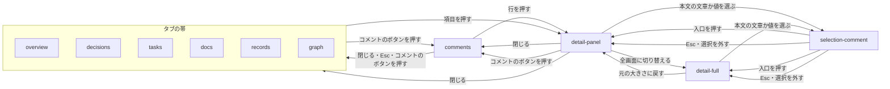

# プレビュー

## 現状

<!-- table: data -->

| 分類 | ページ / ファイル | 概要 | 補足 |
| --- | --- | --- | --- |
| ドキュメント | [設計書/部品設計/プレビュー/回答・意見の送信.ts.yaml](https://github.com/shuhei1101/mindstella/blob/develop/dev/%E8%A8%AD%E8%A8%88%E6%9B%B8/%E9%83%A8%E5%93%81%E8%A8%AD%E8%A8%88/%E3%83%97%E3%83%AC%E3%83%93%E3%83%A5%E3%83%BC/%E5%9B%9E%E7%AD%94%E3%83%BB%E6%84%8F%E8%A6%8B%E3%81%AE%E9%80%81%E4%BF%A1.ts.yaml) | 開いている項目へ回答・意見を直接送る入力欄と送るボタン | 溜める形へ変更 |
| ドキュメント | [設計書/部品設計/プレビュー/トップバー.ts.yaml](https://github.com/shuhei1101/mindstella/blob/develop/dev/%E8%A8%AD%E8%A8%88%E6%9B%B8/%E9%83%A8%E5%93%81%E8%A8%AD%E8%A8%88/%E3%83%97%E3%83%AC%E3%83%93%E3%83%A5%E3%83%BC/%E3%83%88%E3%83%83%E3%83%97%E3%83%90%E3%83%BC.ts.yaml) | 題名・検索の入口・テーマの切り替えとタブの帯 | コメントのボタンを足す |
| ドキュメント | [設計書/画面設計/プレビュー/詳細パネル.yaml](https://github.com/shuhei1101/mindstella/blob/develop/dev/%E8%A8%AD%E8%A8%88%E6%9B%B8/%E7%94%BB%E9%9D%A2%E8%A8%AD%E8%A8%88/%E3%83%97%E3%83%AC%E3%83%93%E3%83%A5%E3%83%BC/%E8%A9%B3%E7%B4%B0%E3%83%91%E3%83%8D%E3%83%AB.yaml) | 項目 1 件の中身と、下端の回答・意見の送信。書きかけは sessionStorage | 入力と選んだ箇所へのコメントの入口を変更 |
| ドキュメント | [設計書/画面設計/プレビュー/詳細の全画面.yaml](https://github.com/shuhei1101/mindstella/blob/develop/dev/%E8%A8%AD%E8%A8%88%E6%9B%B8/%E7%94%BB%E9%9D%A2%E8%A8%AD%E8%A8%88/%E3%83%97%E3%83%AC%E3%83%93%E3%83%A5%E3%83%BC/%E8%A9%B3%E7%B4%B0%E3%81%AE%E5%85%A8%E7%94%BB%E9%9D%A2.yaml) | 詳細パネルの中身を中央のモーダルで出す | 詳細パネルと同じ変更 |
| ドキュメント | [設計書/モジュール構成/プレビュー/画面と部品.ts.yaml](https://github.com/shuhei1101/mindstella/blob/develop/dev/%E8%A8%AD%E8%A8%88%E6%9B%B8/%E3%83%A2%E3%82%B8%E3%83%A5%E3%83%BC%E3%83%AB%E6%A7%8B%E6%88%90/%E3%83%97%E3%83%AC%E3%83%93%E3%83%A5%E3%83%BC/%E7%94%BB%E9%9D%A2%E3%81%A8%E9%83%A8%E5%93%81.ts.yaml) | 画面と部品の TypeScript | コメントの一覧・ポップアップを足す |
| ドキュメント | [設計書/モジュール構成/プレビュー/基盤.ts.yaml](https://github.com/shuhei1101/mindstella/blob/develop/dev/%E8%A8%AD%E8%A8%88%E6%9B%B8/%E3%83%A2%E3%82%B8%E3%83%A5%E3%83%BC%E3%83%AB%E6%A7%8B%E6%88%90/%E3%83%97%E3%83%AC%E3%83%93%E3%83%A5%E3%83%BC/%E5%9F%BA%E7%9B%A4.ts.yaml) | 記録の索引・サーバーの呼び出し・URL のハッシュ | コメントの読み書きの呼び出しを足す |
| 実装 | [plugins/mindstella/skills/mindmap/preview/components/send-form.ts](https://github.com/shuhei1101/mindstella/blob/develop/plugins/mindstella/skills/mindmap/preview/components/send-form.ts) | 回答・意見の送信の部品 | 溜める形へ変更 |
| 実装 | [plugins/mindstella/skills/mindmap/preview/screens/detail.ts](https://github.com/shuhei1101/mindstella/blob/develop/plugins/mindstella/skills/mindmap/preview/screens/detail.ts) | 詳細パネルと詳細の全画面 | 選んだ箇所へのコメントの入口を足す |
| 実装 | [plugins/mindstella/skills/mindmap/preview/core/api.ts](https://github.com/shuhei1101/mindstella/blob/develop/plugins/mindstella/skills/mindmap/preview/core/api.ts) | サーバーの呼び出し | コメントの読み書きを足す |
| 実装 | [plugins/mindstella/skills/mindmap/preview/app.ts](https://github.com/shuhei1101/mindstella/blob/develop/plugins/mindstella/skills/mindmap/preview/app.ts) | 起動・画面の振り分け | コメントの一覧を開く |

<!-- /table -->

## 変更方針

<!-- table: data -->

| 対象 | 方針 | 補足 |
| --- | --- | --- |
| コメントの入力 | 詳細パネルと詳細の全画面の入力は、送らずにレビュー中に溜める。溜めたら入力欄を空にし、溜めたことと件数を入力の近くに出す | 状態は「レビュー中」、溜めるボタンは「レビューに追加」、送るボタンは「まとめて送る」（[要件](./要件.md)） |
| 書きかけの保持 | 書きかけを項目の ID（箇所があれば箇所も）ごとに保ち、パネルを閉じても・再読み込みしても・立ち上げ直しても戻す | サーバーへ送ってワークスペースに置く（[要件](./要件.md)） |
| コメントのボタン | レビュー中のコメントの件数を出し、押すとコメントの一覧を開く。0 件のときも押せる | トップバーの右端。幅 900px 以下は印と件数だけ（[要件](./要件.md)） |
| コメントの一覧 | レビュー中のコメントを溜めた順に並べ、各行に向けた項目（ID・タイトル）・箇所・本文・チェックを出す。チェックしたものだけをまとめて送るボタンを置き、0 件のチェックでは押せない | 新しい画面か、パネル・ダイアログかは画面一覧・画面遷移で決める |
| 一覧から元の場所へ移る | 行を押すと、向けた項目の詳細パネルを開き、箇所があればその箇所までスクロールして示す | - |
| 一覧での編集・削除 | 行の中で本文を書き換え、削除できる。削除は取り消せる手段（確認か元に戻す）を置く | - |
| 項目に紐づかないコメント | コメントの一覧の下端に固定した入力を置き、項目を指さないコメントをいつでも書いて溜める。溜めたコメントは一覧の末尾に足す | - |
| 項目へのレビュー中のコメント | 詳細パネルと詳細の全画面の一番下に、その項目へのレビュー中のコメントを溜めた順に並べる。溜めるとそこに足す | 一覧での編集・削除・チェックはコメントの一覧で行う |
| 選んだ箇所へのコメント | 詳細パネルと詳細の全画面で、本文の文章か項目の値を選び終えたら、選んだ範囲の近くに角の丸いポップアップでコメントの入口を出す。押すと箇所を添えた入力を出す。本文と値の外を選んだとき・選んだ範囲が空のときは出さない | 本文の選択を元の Markdown の行へ対応づけられるかを PoC で確かめる |
| ポップアップの形 | 印と「コメント」の文字を持つピルの形にする | - |
| 送った結果 | 送れたらレビュー中から外して件数を減らす。送れなかったものはレビュー中に残し、理由を出す | - |
| 箇所が合わないコメント | 溜めた後に本文や値が書き換わり、箇所が合わなくなったコメントは、一覧のその行に理由を出し、箇所を外すか消すまで送らない | 1 件でも合わないと、チェックしたものはどれも送らない。向けた項目が消えたコメントは箇所を外しても送れないため、その行には削除だけを示す（画面設計で決める） |
| 配る書き出し | コメントのボタン・一覧・入口・ポップアップを出さない | - |
| アクセシビリティ | コメントのボタン・一覧のチェック・ポップアップに Tab で届く。件数は読み上げの名前に含める。ポップアップは Esc で閉じる | - |
| レスポンシブ対応 | 幅 390px でもコメントの一覧とポップアップが画面に収まる | - |

<!-- /table -->

### 画面一覧

<!-- table: data -->

| 種別 | 画面 | 概要 | アクション | 判定の根拠 | 補足 |
| --- | --- | --- | --- | --- | --- |
| 変更 | `components/topbar` | トップバーにコメントのボタンを足す（全画面で共通） | コメントの一覧を開く | コメントは画面をまたいで溜まるため、画面をまたぐ操作（検索・テーマ）と同じトップバーに置く | 右端に置く（[要件](./要件.md)）。タブの帯を触らず、[#68](https://github.com/shuhei1101/mindstella/issues/68) がタブに印を足す余地を残す。件数は 0 件も出し、読み上げの名前に含める |
| 新規 | `comments` | コメントの一覧（左から出すパネル。見ている画面に重ね、行を押すと右に詳細パネルを開く） | チェックを付ける・外す<br>行を押して向けた項目の詳細を開き、箇所を示す<br>行の中で本文を書き換える<br>削除する・元に戻す<br>項目に紐づかないコメントを書いて溜める<br>チェックしたものをまとめて送る<br>送れなかったものの理由を見る | 見ていた画面に重ねたまま見直すため、左から出すパネルにし、向けた項目は今と同じ右の詳細パネルで見る。本文の書き換えと項目に紐づかないコメントは 1 件をすばやく足す・直すだけのため、その場（行の中・一覧の下端に固定した入力）で行う | 左から出すパネル（下の表）。幅 900px 以下は画面の幅いっぱいに出す。0 件のときは空の状態と、項目に紐づかないコメントの入力だけを出す。配る書き出しには無い |
| 変更 | `detail-panel` | 入力を溜める形にし、選んだ箇所へのコメントの入口を足す | コメントを書いてレビュー中に溜める<br>本文の文章か項目の値を選んでコメントの入口を押す<br>入力に添えた箇所を外す<br>その項目へのレビュー中のコメントを一番下で読む<br>コメントの一覧から開いたとき、箇所までスクロールして示す | 元の画面を見ながら入力するため、今の詳細パネルの中に置く | 入力はパネルの下端（[要件](./要件.md)） |
| 変更 | `detail-full` | `detail-panel` と同じ変更 | `detail-panel` と同じ | 中身は `detail-panel` と同じ部品を使う | 図の拡大を開いている間は入口を出さない |
| 変更 | `components/send-form` | 回答・意見の送信を、溜める形と箇所の添え書きに変える | レビュー中に溜める<br>添えた箇所を外す | 詳細パネルと詳細の全画面とコメントの一覧（項目に紐づかないコメント）の入力を、同じ部品で揃える | 溜めたことと件数を入力の近くに出す |
| 新規 | `components/selection-comment` | 選んだ範囲の近くに出す、角の丸いコメントの入口 | 押して、箇所を添えた入力を出す<br>Esc・選択を外すで閉じる | 1 件をすばやく足すだけのため、その場（選んだ範囲の近く）で行う | 形はピル。押した後は下端の入力に箇所を添える（下の表）。本文と値の外・空の選択では出さない |

<!-- /table -->

`決定`: コメントの一覧の置き方（[確認ログ](./確認ログ.md)）

| 案 | 内容 | メリット | デメリット |
| --- | --- | --- | --- |
| A | 本文の場所に出す画面 `comments` にし、行を押すと右に詳細パネルを開く | 一覧と詳細を並べる既存の形（タブの画面と詳細パネル）と同じで、狭い幅の振る舞いもそのまま使える | 開くと、見ていた画面から離れる |
| B | 左から出すパネルにし、見ている画面に重ねる | 見ていた画面に重ねたまま見直せる | 右の詳細パネルと両側から挟み、幅 1100px 未満では本文がほぼ隠れる |
| C | 詳細パネルを左に出し、コメントの一覧は右から出すパネルにする | 見ていた画面に重ねたまま見直せ、詳細とコメントが左右に分かれる | 左の詳細パネルと右の一覧で両側から挟み、幅 1280px で本文は約 365px、1100px 未満ではほぼ隠れる（案 B と同じ）。一覧を開いていないときも、タブの画面から開く詳細パネルが今の右から左に変わる |

決定: B

`決定`: 選んだ箇所の入口を押した後の入力の置き場所（[確認ログ](./確認ログ.md)）

| 案 | 内容 | メリット | デメリット |
| --- | --- | --- | --- |
| A | 詳細パネル（詳細の全画面）の下端の入力に、選んだ文の引用と箇所を添える | 入力が 1 か所に揃い、AI Monitor の資料のサーバーの「コメントを追加」と同じ流れになる | 選んだ範囲と入力が離れる |
| B | ポップアップを広げ、その場に入力を出す | 選んだ範囲のすぐ近くで書ける | 入力が 2 か所に分かれ、狭い幅ではポップアップが本文を隠す |

決定: A

同じ役割の入力を作り分けず、幅 390px でも入力の置き場所が変わらない。

`決定`: コメントの一覧での削除の取り消せる手段（[確認ログ](./確認ログ.md)）

| 案 | 内容 | メリット | デメリット |
| --- | --- | --- | --- |
| A | 削除した行の場所に「元に戻す」を出す | 操作を止めずに消せ、間違えても戻せる | 戻せる間を決める必要がある |
| B | 確認のモーダルを挟む | 消す前に止められる | 消すたびに 1 手増える |

決定: A

溜めたコメントはまだ送っておらず、戻せれば取り消せない操作にならないため、確認のモーダルの判定に当たらない。

### 画面遷移



- `comments` は見ている画面に重ねて左から出すパネルで、開閉は履歴に積まない。閉じると重ねていた画面に戻る
- `comments` から開いた詳細パネルは箇所までスクロールして示す
- 狭い幅（900px 以下）では `comments` も詳細パネルも画面の幅いっぱいに出し、行を押して開いた詳細パネルを閉じると `comments` へ戻る
- `selection-comment` の開閉は履歴に積まない
- 配る書き出しはコメントのボタン・`comments`・`selection-comment` を持たない

## PoC 結果

<!-- table: data -->

| 検証構成 | 成功条件 | 結果 | PoC PR | 補足 |
| --- | --- | --- | --- | --- |
| 本文のブロックに元の行の印を付け、選択の端までの `\n` と `<br>` を数える | ブロックの種類ごとの対応づけ（7 / 7） | ✅ 7 / 7 | [#80](https://github.com/shuhei1101/mindstella/pull/80)（closed） | 見出し・段落・入れ子の項目・番号付きリスト・表のセルと見出しの行・コードブロック・引用 |
| 同上 | 段落が 2 つある項目の 2 つ目の段落 | ✅ 一致 | [#80](https://github.com/shuhei1101/mindstella/pull/80)（closed） | - |
| 同上 | 項目の中のコードブロック | ✅ 一致 | [#80](https://github.com/shuhei1101/mindstella/pull/80)（closed） | 初回は 1 行ずれた（フェンスの行の分）。フェンスのコードは印をフェンスの次の行にして解消 |
| 同上 | インラインの書式 | ✅ 一致 | [#80](https://github.com/shuhei1101/mindstella/pull/80)（closed） | 太字・リンク・インラインコード・エスケープ |
| 同上 | ソフト改行をまたぐ選択 | ✅ 2 行 | [#80](https://github.com/shuhei1101/mindstella/pull/80)（closed） | - |
| 同上 | ハードブレイク | ✅ 一致 | [#80](https://github.com/shuhei1101/mindstella/pull/80)（closed） | 行末の空白 2 つと行末の `\` |
| 同上 | 同じブロックに同じ文が 2 回ある | ✅ 区別 | [#80](https://github.com/shuhei1101/mindstella/pull/80)（closed） | - |
| 同上 | ブロックをまたぐ選択 | ✅ 一致 | [#80](https://github.com/shuhei1101/mindstella/pull/80)（closed） | 段落からリストへ・図の前後の段落 |
| 同上 | 無害化と置き換えの後の印 | ✅ 欠け 0 | [#80](https://github.com/shuhei1101/mindstella/pull/80)（closed） | 詳細パネルの見出しの段下げで印が消えるため、段下げで印を引き継ぐ |
| 同上 | 描いた見た目 | ✅ 一致 | [#80](https://github.com/shuhei1101/mindstella/pull/80)（closed） | 印の属性を除いた HTML |
| 同上 | 本文の外 | ✅ 返さない | [#80](https://github.com/shuhei1101/mindstella/pull/80)（closed） | 見出しの帯・関係する項目・図の SVG・図の Raw の原文 |
| 同上 | 描く時間（増え 100ms 以内） | ✅ 0.1〜1.0ms | [#80](https://github.com/shuhei1101/mindstella/pull/80)（closed） | 1029 行。今の描き方 7.2〜8.0ms・印を付ける描き方 8.1〜8.3ms（15 回の中央値、3 回の計測） |

<!-- /table -->

結論: 成立。
選択のケース 19 件を詳細パネル・詳細の全画面・資料の本文の 3 か所で確かめ、本文の外・印の残り・見た目・描く時間と合わせて 64 件全てが通った。
使ったメモリは、ページの JavaScript のヒープが計測の前後とも 22.0MB で増えず、端末の空きメモリ（WSL）も実行の前後で 39GB のまま変わらなかった。

本番との違いで見つかったもの:

- 詳細パネルは本文の見出しを段下げした別の要素に差し替える（`screens/detail.ts` の `lowerHeadings`）。差し替えた見出しへ印を写さないと、見出しの行が取れない
- mermaid が SVG の中に描くノードのラベルは `p` の要素で、図の入れ物（`figure.diagram`）の中にある。印を持たないため、本文の外として扱われる

最小再現コードの要点（[#80](https://github.com/shuhei1101/mindstella/pull/80) の `preview/core/libs.ts`）:

- `assignLines`: `marked.lexer` の token の並びに、先頭の行から `raw` の改行を足し進めた行を持たせる。リストの項目と引用は、中の token にも同じ処理をする（字下げを外した `raw` でも改行の数は元と同じ）
- `renderWithLines`: `marked.Renderer` の `heading`・`paragraph`・`code`・`listitem`・`table` を包み、最初の開きタグに `data-line-start` を足す。段落を持つ項目は `li` に付けず中の段落に任せ、mermaid のコードは付けない。フェンスのコードは次の行、表は見出しの行と区切りの行の次から 1 行ずつ
- `selectionLines`: 選択の始点・終点から `.md` の中で印を持つ最も近い祖先を引き、祖先の先頭から端までを `cloneContents` した中の `\n` の数と `br` の数を足す。表の行は数えない。祖先が無ければ null
- diff の見どころ: `libs.ts` の `renderWithLines`・`selectionLines` と、`detail.ts` の `lowerHeadings` の 1 行。テストは `tests/integration/preview/test_poc_selection_lines.py`

核心部（選択の端から行を決める部分）:

```ts
function linesBefore({ block, node, offset }: { block: Element; node: Node; offset: number }): number {
  // 表の行は 1 行で、セルの間の空白の改行は数えない
  if (block.tagName === "TR") return 0;
  const range = document.createRange();
  range.setStart(block, 0);
  range.setEnd(node, offset);
  const fragment = range.cloneContents();
  return countNewlines(fragment.textContent ?? "") + fragment.querySelectorAll("br").length;
}

function lineBlock(node: Node): Element | null {
  const element = node instanceof Element ? node : node.parentElement;
  const block = element?.closest(`[${LINE_ATTR}]`) ?? null;
  return block?.closest(".md") ? block : null;
}

export function selectionLines(range: Range): SelectedLines | null {
  if (range.collapsed) return null;
  const startBlock = lineBlock(range.startContainer);
  const endBlock = lineBlock(range.endContainer);
  if (!startBlock || !endBlock) return null;
  const first = Number(startBlock.getAttribute(LINE_ATTR));
  const last = Number(endBlock.getAttribute(LINE_ATTR));
  return {
    start: first + linesBefore({ block: startBlock, node: range.startContainer, offset: range.startOffset }),
    end: last + linesBefore({ block: endBlock, node: range.endContainer, offset: range.endOffset }),
    text: range.toString(),
  };
}
```

## テスト結果

### 単体

| ファイル | メソッド | 変更種別 | 結果 | 補足 |
| --- | --- | --- | --- | --- |
| [tests/unit/preview/test_api.py](https://github.com/shuhei1101/mindstella/blob/develop/tests/unit/preview/test_api.py) | 全実行 | 変更 | ✅ | 16 テスト pass<br>`テスト結果/20261005064115_1af8780_単体テスト.log` |
| [tests/unit/preview/test_app.py](https://github.com/shuhei1101/mindstella/blob/develop/tests/unit/preview/test_app.py) | 全実行 | 変更 | ✅ | 12 テスト pass<br>`テスト結果/20261005064115_1af8780_単体テスト.log` |
| `tests/unit/preview/test_comments_panel.py` | 全実行 | 新規 | ✅ | 4 テスト pass<br>`テスト結果/20261005064115_1af8780_単体テスト.log` |
| [tests/unit/preview/test_decisions.py](https://github.com/shuhei1101/mindstella/blob/develop/tests/unit/preview/test_decisions.py) | 全実行 | 実行のみ | ✅ | 1 テスト pass<br>`テスト結果/20261005064115_1af8780_単体テスト.log` |
| [tests/unit/preview/test_docs.py](https://github.com/shuhei1101/mindstella/blob/develop/tests/unit/preview/test_docs.py) | 全実行 | 実行のみ | ✅ | 1 テスト pass<br>`テスト結果/20261005064115_1af8780_単体テスト.log` |
| [tests/unit/preview/test_dom.py](https://github.com/shuhei1101/mindstella/blob/develop/tests/unit/preview/test_dom.py) | 全実行 | 実行のみ | ✅ | 32 テスト pass<br>`テスト結果/20261005064115_1af8780_単体テスト.log` |
| [tests/unit/preview/test_graph.py](https://github.com/shuhei1101/mindstella/blob/develop/tests/unit/preview/test_graph.py) | 全実行 | 実行のみ | ✅ | 1 テスト pass<br>`テスト結果/20261005064115_1af8780_単体テスト.log` |
| [tests/unit/preview/test_libs.py](https://github.com/shuhei1101/mindstella/blob/develop/tests/unit/preview/test_libs.py) | 全実行 | 変更 | ✅ | 32 テスト pass<br>`テスト結果/20261005064115_1af8780_単体テスト.log` |
| [tests/unit/preview/test_records.py](https://github.com/shuhei1101/mindstella/blob/develop/tests/unit/preview/test_records.py) | 全実行 | 変更 | ✅ | 10 テスト pass<br>`テスト結果/20261005064115_1af8780_単体テスト.log` |
| [tests/unit/preview/test_router.py](https://github.com/shuhei1101/mindstella/blob/develop/tests/unit/preview/test_router.py) | 全実行 | 実行のみ | ✅ | 10 テスト pass<br>`テスト結果/20261005064115_1af8780_単体テスト.log` |
| `tests/unit/preview/test_selection_comment.py` | 全実行 | 新規 | ✅ | 4 テスト pass<br>`テスト結果/20261005064115_1af8780_単体テスト.log` |
| [tests/unit/preview/test_send_form.py](https://github.com/shuhei1101/mindstella/blob/develop/tests/unit/preview/test_send_form.py) | 全実行 | 変更 | ✅ | 12 テスト pass<br>`テスト結果/20261005064115_1af8780_単体テスト.log` |
| [tests/unit/preview/test_table.py](https://github.com/shuhei1101/mindstella/blob/develop/tests/unit/preview/test_table.py) | 全実行 | 実行のみ | ✅ | 8 テスト pass<br>`テスト結果/20261005064115_1af8780_単体テスト.log` |
| [tests/unit/preview/test_tasks.py](https://github.com/shuhei1101/mindstella/blob/develop/tests/unit/preview/test_tasks.py) | 全実行 | 実行のみ | ✅ | 1 テスト pass<br>`テスト結果/20261005064115_1af8780_単体テスト.log` |

### 結合

| ファイル | メソッド | 変更種別 | 結果 | 補足 |
| --- | --- | --- | --- | --- |
| `tests/integration/preview/test_comments_screen.py` | 全実行 | 新規 | ✅ | 32 テスト pass<br>`テスト結果/20261005081500_21fc7a7_結合テスト.log` |
| [tests/integration/preview/test_decisions_screen.py](https://github.com/shuhei1101/mindstella/blob/develop/tests/integration/preview/test_decisions_screen.py) | 全実行 | 実行のみ | ✅ | 19 テスト pass<br>`テスト結果/20261005081500_21fc7a7_結合テスト.log` |
| [tests/integration/preview/test_detail_full_screen.py](https://github.com/shuhei1101/mindstella/blob/develop/tests/integration/preview/test_detail_full_screen.py) | 全実行 | 変更 | ✅ | 11 テスト pass<br>`テスト結果/20261005081500_21fc7a7_結合テスト.log` |
| [tests/integration/preview/test_detail_panel_screen.py](https://github.com/shuhei1101/mindstella/blob/develop/tests/integration/preview/test_detail_panel_screen.py) | 全実行 | 変更 | ✅ | 30 テスト pass<br>`テスト結果/20261005081500_21fc7a7_結合テスト.log` |
| [tests/integration/preview/test_diagram_viewer_screen.py](https://github.com/shuhei1101/mindstella/blob/develop/tests/integration/preview/test_diagram_viewer_screen.py) | 全実行 | 実行のみ | ✅ | 4 テスト pass<br>`テスト結果/20261005081500_21fc7a7_結合テスト.log` |
| [tests/integration/preview/test_docs_screen.py](https://github.com/shuhei1101/mindstella/blob/develop/tests/integration/preview/test_docs_screen.py) | 全実行 | 実行のみ | ✅ | 14 テスト pass<br>`テスト結果/20261005081500_21fc7a7_結合テスト.log` |
| [tests/integration/preview/test_graph_screen.py](https://github.com/shuhei1101/mindstella/blob/develop/tests/integration/preview/test_graph_screen.py) | 全実行 | 実行のみ | ✅ | 6 テスト pass<br>`テスト結果/20261005081500_21fc7a7_結合テスト.log` |
| [tests/integration/preview/test_open_preview.py](https://github.com/shuhei1101/mindstella/blob/develop/tests/integration/preview/test_open_preview.py) | 全実行 | 変更 | ✅ | 10 テスト pass<br>`テスト結果/20261005081500_21fc7a7_結合テスト.log` |
| [tests/integration/preview/test_overview_screen.py](https://github.com/shuhei1101/mindstella/blob/develop/tests/integration/preview/test_overview_screen.py) | 全実行 | 実行のみ | ✅ | 13 テスト pass<br>`テスト結果/20261005081500_21fc7a7_結合テスト.log` |
| [tests/integration/preview/test_records_screen.py](https://github.com/shuhei1101/mindstella/blob/develop/tests/integration/preview/test_records_screen.py) | 全実行 | 実行のみ | ✅ | 5 テスト pass<br>`テスト結果/20261005081500_21fc7a7_結合テスト.log` |
| [tests/integration/preview/test_search_screen.py](https://github.com/shuhei1101/mindstella/blob/develop/tests/integration/preview/test_search_screen.py) | 全実行 | 実行のみ | ✅ | 5 テスト pass<br>`テスト結果/20261005081500_21fc7a7_結合テスト.log` |
| [tests/integration/preview/test_tasks_screen.py](https://github.com/shuhei1101/mindstella/blob/develop/tests/integration/preview/test_tasks_screen.py) | 全実行 | 実行のみ | ✅ | 8 テスト pass<br>`テスト結果/20261005081500_21fc7a7_結合テスト.log` |
| [tests/integration/preview/test_topbar_screen.py](https://github.com/shuhei1101/mindstella/blob/develop/tests/integration/preview/test_topbar_screen.py) | 全実行 | 変更 | ✅ | 10 テスト pass<br>`テスト結果/20261005081500_21fc7a7_結合テスト.log` |
| `tests/integration/storybook/test_selection_comment_stories.py` | 全実行 | 新規 | ✅ | 5 テスト pass<br>`テスト結果/20261005081500_21fc7a7_結合テスト.log` |
| [tests/integration/storybook/test_send_form_stories.py](https://github.com/shuhei1101/mindstella/blob/develop/tests/integration/storybook/test_send_form_stories.py) | 全実行 | 変更 | ✅ | 14 テスト pass<br>`テスト結果/20261005081500_21fc7a7_結合テスト.log` |
| [tests/integration/storybook/test_table_stories.py](https://github.com/shuhei1101/mindstella/blob/develop/tests/integration/storybook/test_table_stories.py) | 全実行 | 実行のみ | ✅ | 8 テスト pass<br>`テスト結果/20261005081500_21fc7a7_結合テスト.log` |
| [tests/integration/storybook/test_topbar_stories.py](https://github.com/shuhei1101/mindstella/blob/develop/tests/integration/storybook/test_topbar_stories.py) | 全実行 | 変更 | ✅ | 12 テスト pass<br>`テスト結果/20261005081500_21fc7a7_結合テスト.log` |
| [tests/integration/storybook/test_view_switch_stories.py](https://github.com/shuhei1101/mindstella/blob/develop/tests/integration/storybook/test_view_switch_stories.py) | 全実行 | 実行のみ | ✅ | 4 テスト pass<br>`テスト結果/20261005081500_21fc7a7_結合テスト.log` |
