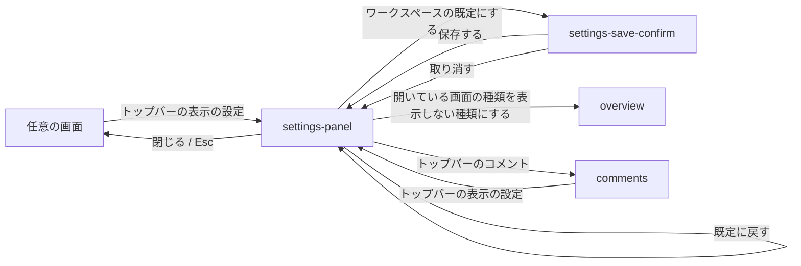

# プレビュー

## 現状

<!-- table: data -->

| 分類 | ページ / ファイル | 概要 | 補足 |
| --- | --- | --- | --- |
| ドキュメント | [設計書/インターフェース定義/プレビュー/プレビューを開く](https://github.com/shuhei1101/mindstella/blob/develop/dev/%E8%A8%AD%E8%A8%88%E6%9B%B8/%E3%82%A4%E3%83%B3%E3%82%BF%E3%83%BC%E3%83%95%E3%82%A7%E3%83%BC%E3%82%B9%E5%AE%9A%E7%BE%A9/%E3%83%97%E3%83%AC%E3%83%93%E3%83%A5%E3%83%BC/%E3%83%97%E3%83%AC%E3%83%93%E3%83%A5%E3%83%BC%E3%82%92%E9%96%8B%E3%81%8F.yaml) | URL のハッシュが指す画面と項目を開く | 開くパスを `mindstella.html` にする。表示しない種類のタブを指すハッシュの扱い |
| ドキュメント | [設計書/モジュール構成/プレビュー/入口.ts](https://github.com/shuhei1101/mindstella/blob/develop/dev/%E8%A8%AD%E8%A8%88%E6%9B%B8/%E3%83%A2%E3%82%B8%E3%83%A5%E3%83%BC%E3%83%AB%E6%A7%8B%E6%88%90/%E3%83%97%E3%83%AC%E3%83%93%E3%83%A5%E3%83%BC/%E5%85%A5%E5%8F%A3.ts.yaml) | 起動・画面の振り分け・端末の保存領域 | 端末の設定（`Prefs`）はライト / ダーク・表の列・差分の時点だけを持つ |
| ドキュメント | [設計書/モジュール構成/プレビュー/基盤.ts](https://github.com/shuhei1101/mindstella/blob/develop/dev/%E8%A8%AD%E8%A8%88%E6%9B%B8/%E3%83%A2%E3%82%B8%E3%83%A5%E3%83%BC%E3%83%AB%E6%A7%8B%E6%88%90/%E3%83%97%E3%83%AC%E3%83%93%E3%83%A5%E3%83%BC/%E5%9F%BA%E7%9B%A4.ts.yaml) | 記録の索引と画面に出す値・取得 | 設定の型に既定のキーを足す |
| ドキュメント | [設計書/部品設計/プレビュー/トップバー.ts](https://github.com/shuhei1101/mindstella/blob/develop/dev/%E8%A8%AD%E8%A8%88%E6%9B%B8/%E9%83%A8%E5%93%81%E8%A8%AD%E8%A8%88/%E3%83%97%E3%83%AC%E3%83%93%E3%83%A5%E3%83%BC/%E3%83%88%E3%83%83%E3%83%97%E3%83%90%E3%83%BC.ts.yaml) | 題名・検索の入口・ライト / ダークとタブの帯 | 表示する種類でタブを絞り、表示の設定の入口を置く |
| ドキュメント | [設計書/部品設計/プレビュー/表.ts](https://github.com/shuhei1101/mindstella/blob/develop/dev/%E8%A8%AD%E8%A8%88%E6%9B%B8/%E9%83%A8%E5%93%81%E8%A8%AD%E8%A8%88/%E3%83%97%E3%83%AC%E3%83%93%E3%83%A5%E3%83%BC/%E8%A1%A8.ts.yaml) | 項目の一覧の表 | 表示する列の選びを端末に残す |
| ドキュメント | [設計書/画面設計/プレビュー/概要](https://github.com/shuhei1101/mindstella/blob/develop/dev/%E8%A8%AD%E8%A8%88%E6%9B%B8/%E7%94%BB%E9%9D%A2%E8%A8%AD%E8%A8%88/%E3%83%97%E3%83%AC%E3%83%93%E3%83%A5%E3%83%BC/%E6%A6%82%E8%A6%81.yaml) | 概要のタイル | 表示しない種類のタイルの扱い |
| ドキュメント | [設計書/画面設計/プレビュー/つながり](https://github.com/shuhei1101/mindstella/blob/develop/dev/%E8%A8%AD%E8%A8%88%E6%9B%B8/%E7%94%BB%E9%9D%A2%E8%A8%AD%E8%A8%88/%E3%83%97%E3%83%AC%E3%83%93%E3%83%A5%E3%83%BC/%E3%81%A4%E3%81%AA%E3%81%8C%E3%82%8A.yaml) | 全種類の項目を 3D で描く | 見た目の値を受け取る（描き分けは #28） |
| 実装 | [plugins/mindstella/skills/mindmap/preview/app.ts](https://github.com/shuhei1101/mindstella/blob/develop/plugins/mindstella/skills/mindmap/preview/app.ts) | 起動・画面の振り分け・端末の設定の読み書き（`loadPrefs` / `savePrefs`） | 2 段の読み分けを足す |
| 実装 | [plugins/mindstella/skills/mindmap/preview/core/records.ts](https://github.com/shuhei1101/mindstella/blob/develop/plugins/mindstella/skills/mindmap/preview/core/records.ts) | 記録と設定の型 | 既定のキーを足す |
| 実装 | [plugins/mindstella/skills/mindmap/preview/core/api.ts](https://github.com/shuhei1101/mindstella/blob/develop/plugins/mindstella/skills/mindmap/preview/core/api.ts) | 配信のエンドポイントの呼び出し | 既定の書き換えの呼び出しを足す |
| 実装 | [plugins/mindstella/skills/mindmap/preview/components/topbar.ts](https://github.com/shuhei1101/mindstella/blob/develop/plugins/mindstella/skills/mindmap/preview/components/topbar.ts) | トップバー | タブの絞り込みと表示の設定の入口 |
| 実装 | [plugins/mindstella/skills/mindmap/preview/components/table.ts](https://github.com/shuhei1101/mindstella/blob/develop/plugins/mindstella/skills/mindmap/preview/components/table.ts) | 表 | 表示する列の選び |

<!-- /table -->

## 変更方針

<!-- table: data -->

| 対象 | 方針 | 補足 |
| --- | --- | --- |
| 2 段の読み分け | 見た目・表示する種類・表の列は、端末の保存領域に値があればそれを、無ければ記録とともに受け取る `config.yaml` の既定を、それも無ければ組み込みの既定を使う。ライト / ダークは今と同じく、上書きが無ければ端末のライト / ダークに従う | 項目ごとに読み分ける |
| 個人の上書きの保存 | 今の端末の設定（`Prefs`）に見た目・表示する種類を足し、同じ localStorage のキーに残す。サーバーへは送らない | 今の値はそのまま読める形で足す |
| 表示の設定の画面 | 見た目・ライト / ダーク・表示する種類・表の列を変え、既定に戻す操作を持つ表示の設定を足す | 置き場所は `### 画面一覧` の `settings-panel`。ライト / ダークと表の列の置き場所は `未確定`（決める段: モック作成） |
| ワークスペースの既定の保存 | 表示の設定から、見た目・表示する種類の今の選びをワークスペースの既定として保存する操作を置く。確かめてから既定の書き換えのエンドポイントを呼ぶ | `未確定`（見せ方は要件.md。決める段: モック作成）。配る書き出しでは出さない |
| 表示する種類 | 表示しない種類のタブをトップバーから外す。表示しない種類の項目へのハッシュ・検索の結果から開いた詳細は、今と同じく開く | 概要とつながりは常に出す |
| 見た目 | 選んだ見た目の値をつながりの画面へ渡す | 値ごとの描き分けは #28 |
| 設定の書き換えの反映 | 書き換えの知らせで受け取った新しい既定を、上書きを持たない項目にだけ当て直す | 再読み込み・既定の書き換えのどちらでも同じ |
| 画面のファイル名 | 配信の画面を `mindstella.html` で開く | ハッシュの形は変えない |

<!-- /table -->

### 画面一覧

| 種別 | 画面 | 概要 | アクション | 判定の根拠 | 補足 |
| --- | --- | --- | --- | --- | --- |
| 新規 | `settings-panel` | 表示の設定。見た目（`glow`・`starlight`・`constellation`・`deep`・`dust`）と表示する種類を選び、個人の上書きとして端末に残す | 見た目を選ぶ 表示する種類を選ぶ 既定に戻す ワークスペースの既定にする 閉じる | 操作の置き場所: 選んだ見た目とタブの増減を元の画面で見ながら変えるため、画面の横に出すパネルにする | 入口はトップバー。コメントの一覧と同じ部品で、見ている画面に重ねて左から出し、幅 900px 以下では画面の幅いっぱいに出す。コメントの一覧とは片方だけを開き、開くともう片方を閉じる。右の詳細パネルは開いたままにする。選んだ値はその場で画面に当てる。開閉は履歴に積まない。配る書き出しでは「ワークスペースの既定にする」を出さない。ライト / ダークと表の列の置き場所は `未確定`（決める段: モック作成） |
| 新規 | `settings-save-confirm` | ワークスペースの既定として保存する前の確かめ | 保存する 取り消す | 操作の置き場所: 同じワークスペースを見る全員の既定を書き換える操作の確認のため、モーダルにする | 見せ方は要件.md の `未確定`（決める段: モック作成）。保存に失敗したときは確かめの中に理由を出し、`config.yaml` と画面の表示を保存の前のまま残す |
| 変更 | `components/topbar` | 表示の設定の入口を足し、表示しない種類のタブを外す | 表示の設定を開く ライト / ダークを切り替える | 構造と遷移: タブの帯には表示する種類だけを並べ、概要とつながりの入口は常に出す | ライト / ダークの切り替えは今のまま残し、選びを個人の上書きとして残す |
| 変更 | `components/table` | 既定に戻すで、表示する列の上書きが外れる | 表示する列を選ぶ | 構造と遷移: 選ぶ部品を結果が出る表の上に置く | 見た目は変えない |
| 変更 | `overview` | 表示しない種類に当たるタイル（納品物・進行中のタスク 等）の扱い | - | - | `未確定`（決める段: モック作成） |

`未確定`: ライト / ダークと表の列の置き場所（決める段: モック作成）

| 案 | 内容 | メリット | デメリット |
| --- | --- | --- | --- |
| A | ライト / ダークはトップバーの切り替え、表の列は表の上の選びに今のまま置き、パネルには見た目・表示する種類だけを並べる。「既定に戻す」は 4 項目全ての上書きを外す | 結果が出る場所の近くで選べ、今の操作が変わらない。パネルが短く済む | 個人の上書きを持つ 4 項目のうち 2 つがパネルに並ばない |
| B | A に加えて、パネルにもライト / ダークを並べる（表の列は種類ごとに違うため表の上に残す） | 端末だけに残す項目をパネルで見渡せる | トップバーと同じ切り替えが 2 か所に並ぶ |

推奨: A

表の列は種類ごとの表に属し、選ぶ部品は結果が出る場所の上に置くため。
ライト / ダークはトップバーで 1 回押せば切り替わり、パネルへ移すと手数が増える。

`未確定`: 表示しない種類に当たる概要のタイル（決める段: モック作成）

| 案 | 内容 | メリット | デメリット |
| --- | --- | --- | --- |
| A | タイルは残し、表示しない種類の画面へ移る「すべて表示」のリンクだけを外す | 進捗や納品物を読み落とさない | 外した種類の項目が概要には出続ける |
| B | 表示しない種類に当たるタイルごと外す | 選んだ種類だけの画面にそろう | ゴールまでの進捗・納品物の判断の材料が概要から消える |

推奨: A

概要のタイルは種類の一覧ではなく、話し合いの進み具合を読む材料のため。

### 画面遷移

開いている画面の種類を表示しない種類にしたときは概要へ移し、履歴は積まずに置き換える。

## テスト結果

未実施
